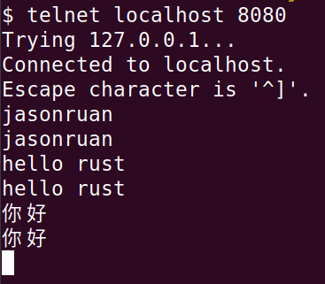

```rust
// https://gist.github.com/fortruce/828bcc3499eb291e7e17
use std::io::Read;
use std::io::Write;
use std::net::{TcpListener, TcpStream};
use std::thread;

// 处理方法入口
fn handle_client(mut stream: TcpStream) {
    // 开启死循环，接收消息，直到客户端连接断开
    loop {
        // 创建接收消息的buffer，一次接收20字节数据
        let mut read = [0; 20];
        // 从流中读取指定长度的数据
        match stream.read(&mut read) {
            // 成功返回实际读取到的字节
            Ok(n) => {
                // 实际读取到的字节长度为0，表示连接断开
                if n == 0 {
                    // 打印连接断开日志
                    println!("connection was closed");
                    // 跳出死循环
                    break;
                }

                // 数据回写
                stream.write(&read[0..n]).unwrap();
            }
            // 失败分支
            Err(err) => {
                // 抛出panic异常
                panic!(err);
            }
        }
    }
}

// 程序入口
fn main() {
    // 创建TCP listener绑定到127.0.0.1:8080，并拆解出listener对象
    let listener = TcpListener::bind("127.0.0.1:8080").unwrap();

    // 遍历incoming()返回的迭代器，用于从listener上获取数据
    for stream in listener.incoming() {
        // 模式匹配迭代器next返回的Result对象
        match stream {
            // 成功分支，解构出stream
            Ok(stream) => {
                // 启动线程，处理请求
                // 通过move关键字在闭包中获取stream所有权
                thread::spawn(move || {
                    // 调用处理方法
                    handle_client(stream);
                });
            }
            // 失败分支，打印错误日志
            Err(_) => {
                println!("Error");
            }
        }
    }
}
```


